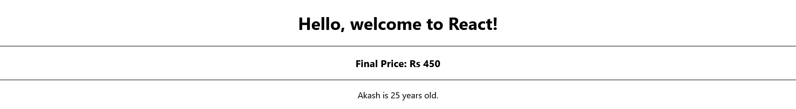

# Getting Started with Simple React Project

- Basic React Projects to learn React component 

## Asignment 1 

    - Q1: Create a simple React functional component called HelloWorld that displays the text "Hello, React!" inside an <h1> tag.

    - Q2: Create a React component called UserInfo that contains a variable userName with a value of "John Doe".

    - Q3: Create a React component to display four sentences in HTML. Each sentence must have a different font color. Use the  tag to set the color.

## Asignment 2 React States
    - Q1: Create a React functional component called Counter that maintains a state variable count. Add two buttons to increment and decrement the count. 

    - Q2 : Build a UserForm component with state variables for name and email. Display the entered values in real-time below the form inputs. 
    
    - Q3: Create two components: Parent and Child. The child component should have an input field, and its value should be updated in the parent component’s state.

## Asignment 3 React Components
    - Q1: Create a ParentComponent that maintains a user's name in its state. Pass this name as a prop to a ChildComponent, which displays it inside a heading (h2). 

    - Q2 : Create a ParentComponent that maintains a counter value in its state. Implement a ChildComponent that contains two buttons: Increment and Decrement. When these buttons are clicked, the ParentComponent’s state should update accordingly.

## Asignment4 React Function
    
    - Q1: Create a React component named Greeting that defines a function called
        getMessage(). This function should return a string "Hello, welcome to React!",
        Inside the JSX, invoke this function and display the message inside an <h1> tag.
  
    - Q2 : Create a React component called ProductPrice.
          Define a function calculateDiscount(price, discountPercent) that calculates and returns the final price after discount.
          Inside JSX, call this function with price = 500 and discountPercent = 10, then interpolate the returned value inside an <h3> tag.
  
    - Q3: Create a React component named UserProfile that has a function called getUserinfoName, age)
          This function should return a string in the format: "User [name] is [age] years old."
          Inside the JSX, call this function with sample values ("Akash", 25) and display the message inside a 
 tag.

## Assignment 5 React Form

- Q1: Create a React form with a single input field for a username. Ensure that the field is
    required, and display an error message if left empty.
- Q2 : Create a form with an email input field. Use a regular expression to validate the
    email format and display an error if invalid.
- Q3 : Create a form with a password field that requires at least 8 characters, including at
    least one number and one special character.
- Q4 : Create a form where the user enters their age. Ensure the age is between 18 and
    60, otherwise display an error.
- Q5 : Create a form where a user enters a password and confirms it. Display an error if
    the passwords do not match.

### `npm start`

Runs the app in the development mode.
Open [http://localhost:3000](http://localhost:3000) to view it in your browser.

